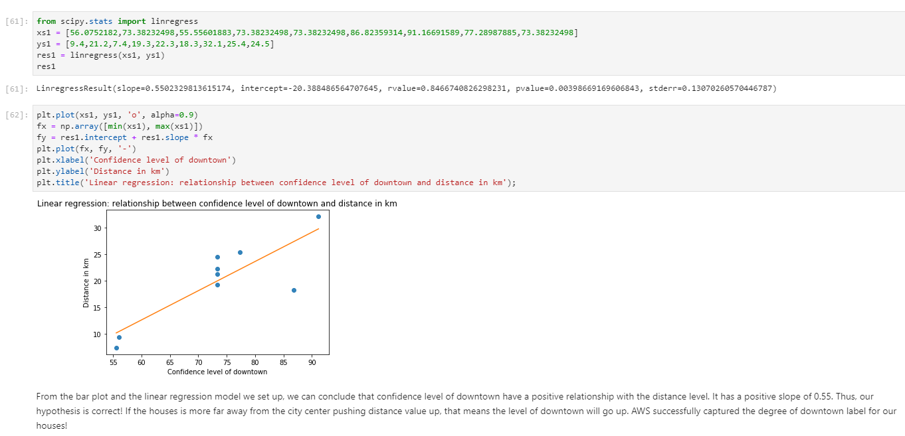

# Rekognition-Project on detecting common traits in Expensive Houses
This project utilized Rekognition and various Python visualization and statistic methods to observe and measure common traits among the Expensive Houses. It uses built-in python [Amazon Rekognition Labels Detection](https://docs.aws.amazon.com/rekognition/latest/dg/labels.html) to identify which labels are frequently exists in these expensive houses and how the confidence level of these label can in fact tell the observer any information related to the housing price.

## Project Link
[Sample Project Link](https://beijinghousingprice.s3.amazonaws.com/Napolis_final.html)

## Architecture and explanation

We collected 9 expensive Houses ranged from 1 million to 2 million dollars in the website [LianJia](https://bj.lianjia.com/), the largest second-hand trade platform in China. There are also websites that can be accessed to collect similar sources such as [Zillow](https://www.zillow.com/) and [Trulia](https://www.trulia.com/). All of the websites provided basic information of the real estate property, such as pictures of the houses, housing price, location, neiborhood, transportation around and etc. After collecting pictures, upload all these pictures to S3 buckets. By using Rekogntion to detect labels and confidence level, use the Seaborn or Matplotlib to generate analysis and visualization.

## Customizing Solutions

### Amazon Sagemaker

Amazon SageMaker is a fully managed service that provides every developer and data scientist with the ability to build, train, and deploy machine learning (ML) models quickly.

SageMaker removes the heavy lifting from each step of the machine learning process to make it easier to develop high quality models.

### Amazon S3 Bucket

Create a S3 bucket to store the build artifacts: AWS CloudFormation (CFN) templates and Amazon Lambda packages.

Note: make sure to choose the region you intend to run the workflow; for example, us-east-1 region.

### Amazon Rekognition Service

Amazon Rekognition provides fast and accurate face search, allowing you to identify a person in a photo or video using your private repository of face images. 

You can also verify identity by analyzing a face image against images you have stored for comparison.

## How to upload files to S3 bucket 
Have a look at the S3 Bucket Service provided by cloud storage from AWS
[S3 Bucket Service](https://docs.aws.amazon.com/AmazonS3/latest/dev/UsingBucket.html)

Click upload to upload any pictures to the Bucket

We can see address showed in the details panel that can be provided to the Rekognition Service for detection

## Example of detection

We wrote three lines of code to generate these capture.
First is to call the AWS Rekogntion Service from the Boto3 packages
Second is to indicated the Path in the S3 Bucket for Rekogntion to detect
Third is to display the detected labels
We can see the built in Rekogntion Service succesfully capture and detect elements in the picture

## Sample of Analysis and Visualization
Easily use service provided by Seaborn and Matplot to generate various visualization such as scatterplot and bar plot. Use different stats function to generate correlation and linera regression

## Cost Estimation
* [Amazon Rekognition Image - Labels Detection](https://aws.amazon.com/rekognition/pricing/)
* [Amazon S3](https://aws.amazon.com/s3/pricing/)
  * Intelligent - Tiering
  * Transfer acceleration
* [Amazon Sagemaker](https://aws.amazon.com/sagemaker/pricing/)

## Resources
* [Amazon S3](https://aws.amazon.com/s3/) Buckets (x2)
  * a web bucket to host the web application
  * a source bucket to store images for training data, images for analysis, and dataset manifests
* [Amazon Rekognition](https://aws.amazon.com/rekognition/)
  * a Custom Labels Project is created during the stack creation. The Project is then used to train your own model and run inference endpoint
* [Amazon Sagemaker](https://aws.amazon.com/sagemaker/)
  * using jupyter Notebook to deploy Rekogntion and other Python utilizations
  
## Package Using in Python by Jupyter Notebook

## Contributor to this Demo walkthrough
Baichen Rong

Jason Gao

Shah Jash
